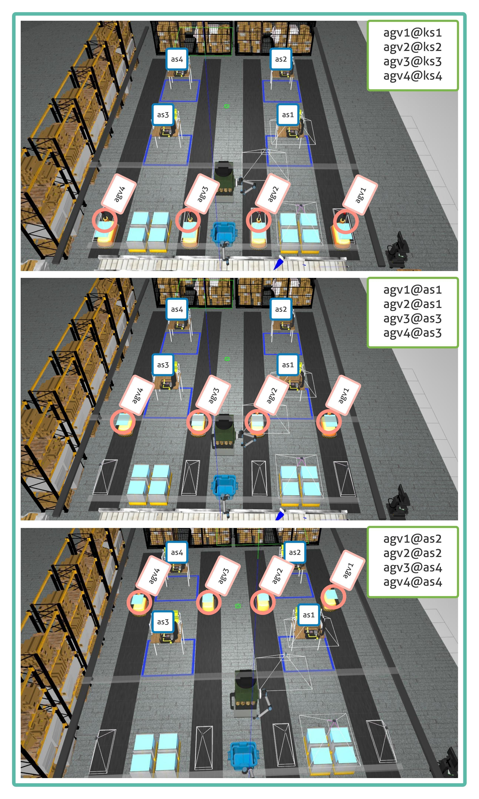
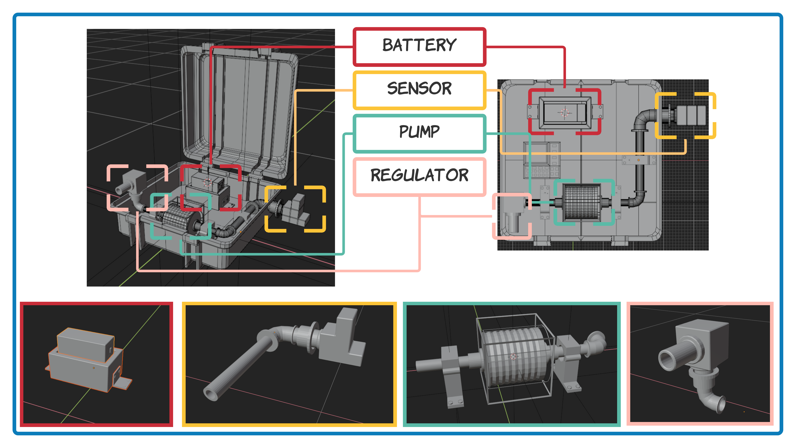
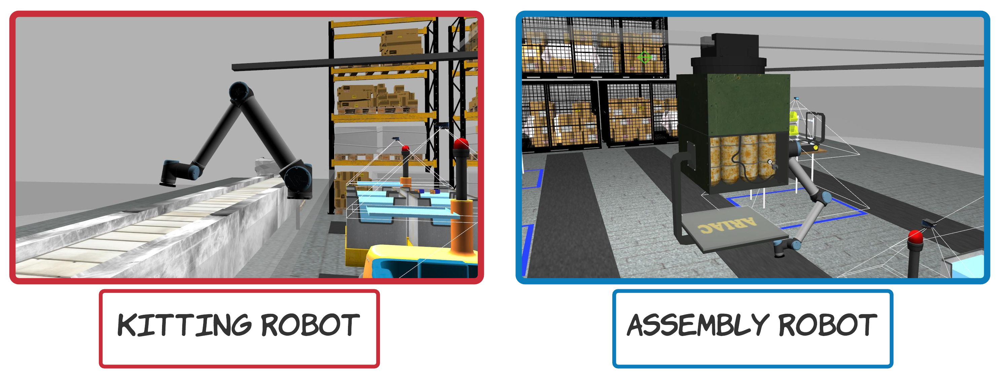
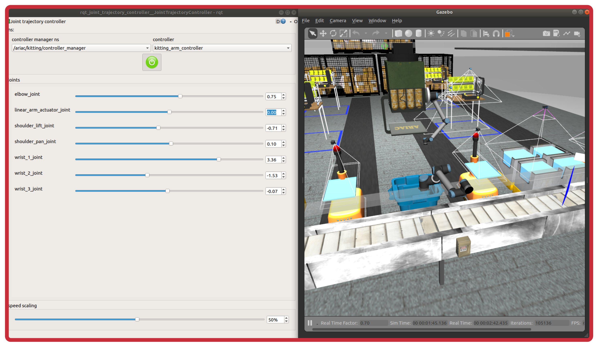
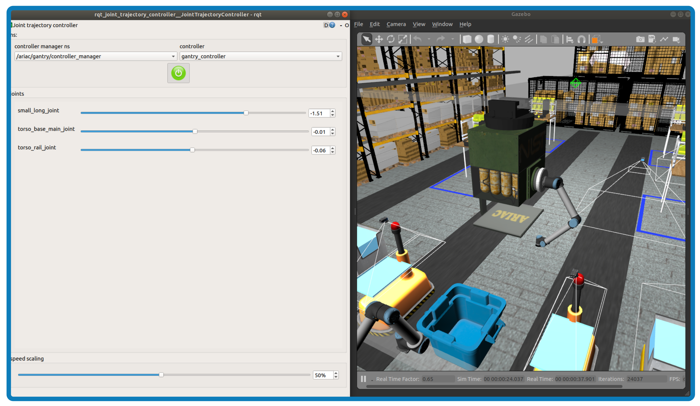

Wiki | [Home](../../README.md) | [Documentation](../documentation/documentation.md) | [Tutorials](../tutorials/tutorials.md) | [Qualifiers](../qualifiers/qualifier.md) | [Finals](../finals/finals.md)

-------------------------------------------------

- [Wiki | Documentation | Competition Specifications](#wiki--documentation--competition-specifications)
  - [Competition Scenarios](#competition-scenarios)
  - [Environment](#environment)
    - [Automated Guided Vehicles (AGVs)](#automated-guided-vehicles-agvs)
    - [Conveyor Belt](#conveyor-belt)
    - [Faulty Part Collector](#faulty-part-collector)
    - [Product Bins](#product-bins)
    - [Parts](#parts)
    - [Trays](#trays)
    - [Briefcases](#briefcases)
  - [Robots](#robots)
    - [Kitting Robot](#kitting-robot)
    - [Assembly Robot](#assembly-robot)
  - [Sensors](#sensors)
  - [Order](#order)
    - [Kitting Shipments](#kitting-shipments)
    - [Assembly Shipments](#assembly-shipments)
  - [Agility Challenges](#agility-challenges)
  - [Scoring](#scoring)
  - [Competition Process](#competition-process)

# Wiki | Documentation | Competition Specifications

This page outlines the specifications for [the Agile Robotics for Industrial Automation Competition](https://www.nist.gov/el/intelligent-systems-division-73500/agile-robotics-industrial-automation-competition) (ARIAC) 2021.

## Competition Scenarios

ARIAC requires competitors to complete a series of tests centered in an industrial scenario that are based around order fulfillments. The robot system will work within the environment specified in the Work Environment section.

There are **three** different test scenarios that all involve moving products from a supply location to either a shipping box or an assembly station. The possible supply locations are a set of stationary bins, a conveyor belt, and Automated Guided Vehicles (AGVs). Challenges will be introduced in each scenario. Details about the scenarios follow.

- **Scenario 1: Baseline Kit Building**

This scenario is intended as a baseline set of kitting tasks for the other kitting test methods to be compared against. The task for this scenario is to pick specific products and place them on a kit tray. In baseline kit building, an order that contains at least one kitting shipment will be announced on the `/ariac/orders` topic. The kitting shipment(s) in this order will provide a list of product types and poses in kit tray frames. Orders are covered in more detail in the [Order](competition_specifications.md#order) section.

- **Scenario 2: Baseline Assembly**

This scenario is intended as a baseline set of assembly tasks for the other assembly test methods to be compared against. The task for this scenario is to pick products and place them in briefcases located at assembly stations. In baseline assembly, an order that contains at least one assembly shipment will be announced on the `/ariac/orders` topic. Similar to kit building, assembly shipments in this order will provide a list of product types and poses in briefcase frames. 
  
- **Scenario 3: In-Process Order Change**

    While the robot is in the middle of doing kitting or assembly, a new high-priority order will be received. This new order needs to be completed as fast as possible. The robot will need to decide how best to complete this new order first before resuming the first order.
  

    <!-- While the robot is in the middle of doing kitting or assembly, an event will trigger one of the two robots to breakdown. The disabled robot can not be used for any task and the other robot needs to do a task changeover.  -->

---
The competition will consist of 15 trials: 5 trials for each scenario. Each trial will receive a score based on completion and efficiency metrics outlined on the [Scoring section](scoring.md). Details of the agility challenges used in these scenarios can be found on the [agility challenge](agility_challenges.md) page.

---

## Environment

The simulation environment is a representation of an order fulfillment workcell with a kitting robot and an assembly robot (gantry robot), a conveyor belt, product bins, assembly stations, and AGVs.


### Automated Guided Vehicles (AGVs)

Competitors will need to build kits on the back of AGVs (in kit trays) during kitting. During assembly, competitors will need to pick up parts from AGV trays and place them in briefcases to build ventilators.

When a trial starts, each AGV is located at one of the 3 possible locations `ks[1,2,3,4]` or `as[1,2,3,4]`where `ks` stands for kitting station and `as` stands for assembly station. The table below shows the possible locations for each AGV. 

|       | `agv1` | `agv2` | `agv3` | `agv4` |
|-------|--------|--------|--------|--------|
| `ks1` |    x   |        |        |        |
| `ks2` |        |    x   |        |        |
| `ks3` |        |        |    x   |        |
| `ks4` |        |        |        |    x   |
| `as1` |    x   |    x   |        |        |
| `as2` |    x   |    x   |        |        |
| `as3` |        |        |    x   |    x   |
| `as4` |        |        |    x   |    x   |

To learn how AGV locations are specified for a trial, please take a look at the section on [YAML Configuration Files](configuration_files.md).

The figures below shows where AGVs stop for each of the three locations. To learn how to submit kitting shipments with AGVs, please see [GEAR Interface](../tutorials/gear_interface.md).



### Conveyor Belt

- The conveyor belt is a **0.65 m** wide, **9 m** long plane that transports objects across the work environment.
- The following properties impact teams' interaction with the belt:
  - Products will travel down the belt at a fixed speed of **0.2 m/s**.
  - Competitors can control the conveyor belt during development, but not during the final competition.
  - There is a limited supply of products on the belt, and any products placed on the belt are automatically removed if they reach the end of the belt. Products will not be replaced once removed.

### Faulty Part Collector

- ARIAC 2021 has now a faulty part collector which should be used to discard faulty products. In the past, competitors will drop faulty products on the floor, which is not something that would happen in a real manufacturing plant. The faulty part collector has a deletion wall which will remove products from the scene when they are dropped in the collector. Dropping a product on the floor will also remove the product from the scene. A penalty may be applied to competitors dropping faulty products on the floor.

### Product Bins

- There are 8 product bins that may be used for building kits.
- Products in these bins will not be replaced once used.
- All products in a particular storage bin are of the same type and have the same orientation.
- The product bins are shallow boxes measuring **0.6 x 0.6 m**.

### Parts

- ARIAC 2021 has 4 part types (battery, sensor, regulator, and pump).
- Each part type comes in 3 colors (see figure below).


### Trays

Kitting shipments must be performed on trays located on AGVs. When a shipment is complete, competitors programmatically signal the AGVs to go to an assembly station. Based on the environment shown earlier, AGV1 and AGV2 can only go to assembly stations 1 and 2. AGV3 and AGV4 can only go to assembly stations 3 and 4. Each tray is shallow and measures **0.5 x 0.7 m**.

### Briefcases

- Briefcases are ventilators used for patients in intensive care units (ICU). Since the theme of this year revolves around the pandemic, ventilator parts and ventilator assembly are introduced. Below is a series of figures showing how products fit in the briefcases.



## Robots

ARIAC 2021 consists of two robots: kitting robot and assembly robot.



### Kitting Robot



Single 6 DoF UR10 arm mounted on a linear rail. This robot can only do kitting as it cannot reach the assembly stations.

- The base moves at a velocity of **4 m/s** and its range on the linear rail is **y=[-4.80, 4.80]**
- The end of the arm is equipped with a vacuum gripper. The vacuum gripper is controlled in a binary manner (on/off) and reports whether or not it is successfully gripping an object.


To start the arm in rqt with the `joint_trajectory_controller` plugin:

```bash
rosrun rqt_joint_trajectory_controller rqt_joint_trajectory_controller robot_description:=/ariac/kitting/robot_description
```

### Assembly Robot



The assembly robot is a gantry robot mounted on the ceiling, the robot consists of:

- One linear actuator (`small_long_joint`) which allows the small rail to move along the two long rails at a velocity of **4 m/s** within the range **[-12.40, 2.40]**.
- One linear actuator (`torso_rail_joint`) which controls the base of the torso on the small rail at a velocity of **4 m/s** and is within the range **y=[-4.50, 4.50]**.
- One rotatory torso (`torso_base_main_joint`) which rotates 360 degrees around the base z-axis with the range **[-6.28, 6.28]**.
- One 6 DoF UR10 arm attached to the torso with a fixed joint.
- One tray is attached to the torso. Participants may put parts in this tray while fetching other parts in the environment.
- The end of each arm is equipped with a vacuum gripper.

To start the arm in rqt with the `joint_trajectory_controller` plugin:

```bash
rosrun rqt_joint_trajectory_controller rqt_joint_trajectory_controller robot_description:=/ariac/gantry/robot_description
```

## Sensors

Competitors can place sensors around the environment in static locations. Sensors can be placed in any free space in the workcell, they do not need to be mounted so that they are touching the conveyor belt/support frame of the storage bin. Sensors must be used in a realistic manner and must not exploit any simulation technicalities such as the logical camera seeing through obstructions. Each sensor has a cost that factors into the final score. Available sensors are:

- **Break beam**: reports when a beam is broken by an object. It does not provide distance information.
- **Laser scanner**: provides an array of distances to a sensed object.
- **Depth camera**: provides a point cloud of sensed distances.
- **Cognex logical camera**: provides information about the pose and type of all models within its field of
   view. **NOTE**: The range of the logical camera has been increased to cover 4 bins at a time (instead of 1 bin previously). With this new range, 2 logical cameras should be sufficient to cover the surface of a shelf.
- **Proximity sensor** outputs how far an object is from the sensor.
- **RGB-D camera**: provides point cloud data (similar to the depth camera) along image data.

For the details about how to configure the sensor locations, see the [YAML Configuration Files](configuration_files.md) page. More details on each sensor can be found on the [sensor Interface](../tutorials/sensor_interface.md) page.

## Order

An order is an instruction containing kits or assembly products for the robot system to complete. Each order will specify the list of products to be put in the shipment, including the type, color, and position/orientation of each product.

An order consists of at least one task, either `kitting` or `assembly`. Each task consists of at least one shipment and each shipment consists of at least one product.

For each trial, the first order (`order_0`) is always announced at the start of the competition (after the call to `start_competition` is made). If the trial consists of multiple orders, subsequent orders are announced either as part of the agility challenge [New Order](agility_challenges.md#new-order) or as a new order with only an assembly shipment. The latter order is not considered a high-priority order (`priority = 1`) and is announced once the competitors deliver an AGV to an assembly station. An example of such orders can be found in [sample_multiple_non_high_priority_orders.yaml](../../nist_gear/config/trial_config/sample_multiple_non_high_priority_orders.yaml)

More information on how to read orders published on `/ariac/orders` can be found on the [GEAR Interface](../tutorials/gear_interface.md) page. To understand how orders are described in YAML, please see the [YAML Configuration Files](configuration_files.md) page.


### Kitting Shipments

- To deliver `kitting` shipments, competitors must deliver the AGVs to assembly stations. Below is an example of a kitting shipment as published on the topic `ariac/orders`.
  - The id of the order is `order_0`
  - The order consists of only one shipment (`order_0_kitting_shipment_0`) which must be built on `agv2` and delivered to the assembly station `as1`. The shipment consists of 3 products and the pose of each product is expressed in the frame of the kit tray located on `agv2`.
  
```bash
order_id: "order_0"
kitting_shipments: 
  - 
    shipment_type: "order_0_kitting_shipment_0"
    agv_id: "agv2"
    station_id: "as1"
    products: 
      - 
        type: "assembly_battery_blue"
        pose: 
          position: 
            x: 0.1
            y: 0.1
            z: 0.0
          orientation: 
            x: 0.0
            y: 0.0
            z: 0.0
            w: 1.0
      - 
        type: "assembly_regulator_red"
        pose: 
          position: 
            x: 0.15
            y: 0.1
            z: 0.0
          orientation: 
            x: 0.0
            y: 0.0
            z: 0.0
            w: 1.0
      - 
        type: "assembly_sensor_blue"
        pose: 
          position: 
            x: -0.1
            y: -0.1
            z: 0.0
          orientation: 
            x: 0.0
            y: 0.0
            z: 0.0
            w: 1.0
assembly_shipments: []
---
```

- When kitting shipments are required on a specific AGV, the AGV will be empty (no products in the tray of the AGV) and located at its kitting station (`agv1` at `ks1`, `agv2` at `ks2`, `agv3` at `ks3`, and `agv4` at  `ks4`).
- In the situation where `agv_id: "any"`, competitors will have the choice of the AGV and there will always be an available AGV for the shipment. For instance, in the following order snippet, competitors will have the choice between `agv1` or `agv2` because only these two AGVs can reach `as1` (see the section on AGV above).

```bash
    agv_id: "any"
    station_id: "as1"
```

### Assembly Shipments

- To deliver assembly shipments, competitors must submit the assembly product (nothing visually happens when an assembly shipment is submitted). 

When assembly is announced in an order, competitors will encounter the following situations (either one of them or both of them):

1. At the beginning of a trial some AGVs will already be located at assembly stations where assembly is required.
2. Competitors will first receive a kitting shipment to complete. Once the shipment is submitted a new order will be announced with an assembly to be performed at the station where the AGV was delivered.

- **NOTE**: Competitors are not forced to do assembly from parts located on the AGVs, however, this is strongly recommended. Although competitors are free to pick up parts from bins/conveyor belt and bring them directly to briefcases, there are a few points to consider in doing so:
    - Taking parts from bins/conveyor belt are not guaranteed to be non-faulty parts. AGVs already located at assembly stations (situation 1.) are guaranteed to be free of faulty parts. In the situation where  competitors are tasked to do kitting first and then assembly (situation 2.), the probability of using faulty parts at an assembly station is still lower than picking up parts directly from bins/conveyor belt (assuming competitors removed faulty parts before submitting the AGVs).
    - It may take longer to pick parts from bins/conveyor belt than to use the ones already located on the AGVs.

An order which consists of only one assembly shipment is displayed below. `station_id` shows that assembly has to be performed at assembly station `as1` and the pose of each product in this shipment is in the frame of the briefcase at the assembly station.

```bash
order_id: "order_0"
kitting_shipments: []
assembly_shipments: 
  - 
    shipment_type: "order_0_assembly_shipment_0"
    station_id: "as1"
    products: 
      - 
        type: "assembly_battery_green"
        pose: 
          position: 
            x: -0.032465
            y: 0.174845
            z: 0.15
          orientation: 
            x: 0.0
            y: 0.0
            z: 0.0
            w: 1.0
      - 
        type: "assembly_pump_blue"
        pose: 
          position: 
            x: 0.032085
            y: -0.152835
            z: 0.25
          orientation: 
            x: 0.0
            y: 0.0
            z: 0.0
            w: 1.0
---
```


## Agility Challenges

Each trial will come with a set of [agility challenges](agility_challenges.md).

<!-- Throughout the workcell are quality control sensors that detect faulty products. If faulty products are detected while teams are fulfilling orders, those products should be removed from the tray (and placed in the faulty product collector) and replaced with another product of the same type. Faulty products will not count for any points when the shipment is submitted, and they will cost teams the all-products bonus if left in trays. -->

## Scoring

Performance scores will be automatically calculated for each trial as a combination of performance metrics and costs.
These will be combined with scores from judges to determine the final winners.
See the [scoring metrics](scoring.md) page for more details.

## Competition Process

Each trial will consist of the following steps:

1. Programmatically start the competition through the `ariac/start_competition` service. This will activate many components of the GEAR interface such as starting of the conveyor belt, publishing messages on multiple topics, and announcing orders.

2. The first Order (`order_0`) is sent to the topic `ariac/orders`.
   1. **NOTE**: If multiple orders are published on this topic, only the newest order will be visible as it replaces the previous order. It is recommended that competitors store all orders in a data structure.
3. Complete each shipment in each order and then submit the shipments.
4. When all orders are completed (all shipments submitted), the trial will automatically end and a breakdown of the final score is announced to the competitors. There are no time limits for individual orders, but each trial has a time limit (**500** simulation seconds). The time limit is not broadcast on the ARIAC server but will be communicated to competitors beforehand.

For details on how the communication with the competition system is performed during the trial, see the [competition interface](competition_interface_documentation.md) page.

-------------------------------------------------

Wiki | [Home](../../README.md) | [Documentation](../documentation/documentation.md) | [Tutorials](../tutorials/tutorials.md) | [Qualifiers](../qualifiers/qualifier.md) | [Finals](../finals/finals.md)
